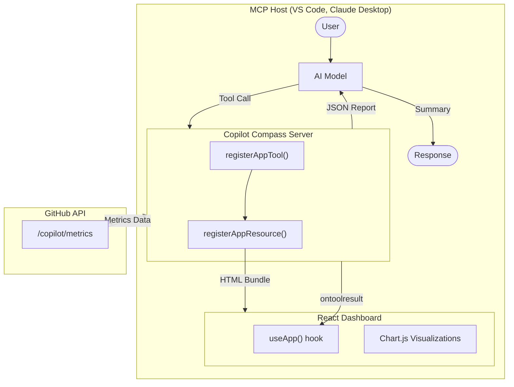

Measuring GitHub Copilot adoption across your organization can be challenging. While GitHub provides usage metrics through APIs, transforming that raw data into actionable intelligence requires additional tooling. That is where **Copilot Compass** comes in.


## What is Copilot Compass?

[Copilot Compass](https://github.com/samueltauil/copilot-compass) is an MCP (Model Context Protocol) application that transforms raw GitHub Copilot metrics into an interactive visual dashboard. Built with the MCP Apps SDK, it provides both AI-readable data and a React-based UI that renders directly in MCP-compatible hosts like VS Code and Claude Desktop.

### Key Differentiators

Unlike traditional dashboards, Copilot Compass leverages the MCP Apps SDK pattern:

- **AI-First**: Tools return structured data that AI models can analyze and summarize
- **Visual Dashboard**: The same tool invocation renders an interactive React UI in the host
- **Real-Time Sync**: The UI automatically updates when new data arrives via `ontoolresult`
- **Host Theming**: The dashboard adapts to the host's color scheme via `useHostStyles`

## Key Features

### Analytics Dashboard

The dashboard provides comprehensive analytics across several dimensions:

| Metric | What It Measures | Why It Matters |
|--------|------------------|----------------|
| **Active Users** | Unique users who received Copilot suggestions | Adoption breadth |
| **Engaged Users** | Users who accepted at least one suggestion | Active value extraction |
| **Acceptance Rate** | Accepted suggestions divided by total suggestions | Quality of suggestions |
| **Lines Accepted** | Actual code lines integrated from Copilot | Productivity impact |
| **Chat Sessions** | Copilot Chat conversations initiated | AI pair programming usage |
| **Code Insertions** | Chat-generated code added to files | Conversational coding value |
| **PR Summaries** | Pull request descriptions auto-generated | Review process efficiency |

### Visualizations

The dashboard includes multiple visualization types:

- **Active Users Trend** - 14-day line chart with daily active user counts
- **Acceptance Rate** - Track code suggestion acceptance over time
- **Language Breakdown** - Top languages by suggestions, acceptances, and engaged users
- **Editor Distribution** - Usage split across VS Code, JetBrains, Neovim, and more
- **Chat Metrics** - Sessions, code insertions, and copy events from Copilot Chat
- **PR Intelligence** - Pull request summary generation statistics

<div style="display: grid; grid-template-columns: repeat(2, 1fr); gap: 10px; margin: 20px 0;">
  
  
  
  
</div>

## Getting Started

### Prerequisites

- **Node.js** 18+
- **VS Code Insiders** - Required for MCP Apps SDK (interactive dashboard). [Download here](https://code.visualstudio.com/insiders/).
- **GitHub PAT** with scopes:
  - `manage_billing:copilot` - Access Copilot metrics
  - `read:enterprise` - Enterprise-level access
  - `read:org` - Organization metrics

### Installation

```bash
# Clone the repository
git clone https://github.com/samueltauil/copilot-compass.git
cd copilot-compass

# Install dependencies
npm install

# Configure environment
cp .env.example .env
# Edit .env and add your GITHUB_TOKEN
```

### Build and Run

```bash
# Build the React dashboard and TypeScript server
npm run build

# Start the MCP server
npm start
```

The server starts at `http://localhost:3001` with:
- **MCP Endpoint**: `http://localhost:3001/mcp`
- **Health Check**: `http://localhost:3001/health`

### Connecting to VS Code

Add to your MCP configuration in VS Code:

```json
{
  "mcpServers": {
    "copilot-compass": {
      "type": "http",
      "url": "http://localhost:3001/mcp"
    }
  }
}
```

Alternatively, use the built-in command:

1. Press `Ctrl+Shift+P` (or `Cmd+Shift+P` on macOS)
2. Type "MCP: Add Server"
3. Choose "HTTP" transport
4. Enter a name: `copilot-compass`
5. Paste the URL: `http://localhost:3001/mcp`

## Using Copilot Compass

Once configured, open GitHub Copilot Chat and request a report:

```
Generate a Copilot report for enterprise "acme-corp" from 2024-01-01 to 2024-01-31
```

The AI will call the `generate_copilot_report` tool, which:

1. Fetches metrics from the GitHub Copilot API
2. Transforms the data into a structured report
3. Returns JSON to the AI for summarization
4. Renders the interactive dashboard in VS Code

### Tool Parameters

| Parameter | Type | Required | Description |
|-----------|------|----------|-------------|
| `enterpriseSlug` | string | Yes | Enterprise identifier |
| `orgName` | string | No | Organization within enterprise |
| `dateRange.from` | string | Yes | Start date (YYYY-MM-DD) |
| `dateRange.to` | string | Yes | End date (YYYY-MM-DD) |

### Enterprise vs Organization Metrics

Copilot Compass supports fetching metrics at two levels, both using the same underlying data structure but with different scopes:

**Enterprise Level** (`/enterprises/{enterprise}/copilot/metrics`)
- Aggregates usage data across all organizations in the enterprise
- Requires a GitHub PAT with `manage_billing:copilot` and `read:enterprise` scopes
- Provides a holistic view of Copilot adoption across your entire company
- Best for executives and platform teams tracking company-wide adoption

**Organization Level** (`/orgs/{org}/copilot/metrics`)
- Scoped to a single organization
- Requires a GitHub PAT with `manage_billing:copilot` and `read:org` scopes
- Useful for org admins tracking their team's specific usage
- Best for team leads and department-level reporting

Both levels return the same metrics structure:

| Metric Category | Data Included |
|----------------|---------------|
| **Code Completions** | Suggestions, acceptances, lines of code, acceptance rate |
| **Language Breakdown** | Per-language statistics (TypeScript, Python, etc.) |
| **Editor Distribution** | Usage by IDE (VS Code, JetBrains, Neovim) |
| **IDE Chat** | Chat sessions, code insertions, copy events |
| **Dotcom Chat** | GitHub.com Copilot Chat usage |
| **Pull Requests** | PR summary generation statistics by repository |

To use organization-level metrics instead of enterprise, simply provide the `orgName` parameter:

```
Generate a Copilot report for organization "my-team" from 2024-01-01 to 2024-01-31
```

## Architecture

The application follows a typical MCP Apps pattern with tool-UI binding:



### Key Components

**Server Side (`server.ts`):**

```typescript
import { registerAppTool, registerAppResource } from "@modelcontextprotocol/ext-apps/server";

// Register the tool with UI metadata
registerAppTool(
  server,
  "generate_copilot_report",
  {
    title: "Generate Copilot Report",
    description: "Generate a comprehensive Copilot usage report",
    inputSchema: reportInputSchema.shape,
    _meta: { ui: { resourceUri } },
  },
  async (args) => {
    const report = await generateReport(args);
    return {
      content: [{ type: "text", text: JSON.stringify(report) }],
    };
  }
);
```

**Client Side (`mcp-app.tsx`):**

```tsx
import { useApp, useHostStyles } from "@modelcontextprotocol/ext-apps/react";

function CopilotCompassApp() {
  const [report, setReport] = useState(null);

  const { app, error } = useApp({
    appInfo: { name: "Copilot Compass", version: "1.0.0" },
    onAppCreated: (app) => {
      app.ontoolresult = async (result) => {
        const data = JSON.parse(result.content[0].text);
        setReport(data);
      };
    },
  });

  // Apply host theme styles
  useHostStyles(app);

  // Render dashboard with Chart.js visualizations
}
```

## Running in GitHub Codespaces

For the quickest setup, use GitHub Codespaces:

[](https://codespaces.new/samueltauil/copilot-compass?quickstart=1)

When your Codespace starts:
1. Dependencies are installed and the project is built
2. The MCP server starts automatically on port 3001
3. Port 3001 is made public with HTTPS
4. MCP config is created automatically

### MCP Apps SDK and VS Code Compatibility

The interactive dashboard UI relies on the **MCP Apps SDK**, which is currently only supported in **VS Code Insiders**. The Codespaces web editor uses VS Code Stable, which supports basic MCP tools but does not yet render the visual dashboard UI.

**Your options:**

1. **Connect from VS Code Insiders Desktop (recommended for full UI)**: Install [VS Code Insiders](https://code.visualstudio.com/insiders/) locally, add the [GitHub Codespaces extension](https://marketplace.visualstudio.com/items?itemName=GitHub.codespaces), and connect to your Codespace from there.

2. **Use Codespaces web editor (tools only)**: The MCP tools will work and return JSON data that the AI can summarize, but the interactive React dashboard will not render.

MCP Apps SDK support is expected to ship in VS Code Stable in a future release. For the latest updates on MCP support in VS Code, see the [official MCP documentation](https://code.visualstudio.com/docs/copilot/chat/mcp-servers) and the [MCP Apps SDK repository](https://github.com/modelcontextprotocol/ext-apps).

## Exposing Publicly with Cloudflare Tunnel

For remote access or sharing, you can expose the local server using Cloudflare Tunnel:

```bash
# Install cloudflared
winget install cloudflare.cloudflared  # Windows
brew install cloudflared                # macOS

# In one terminal, start the MCP server
npm start

# In another terminal, create the tunnel
cloudflared tunnel --url http://localhost:3001
```

Cloudflared outputs a public URL like `https://random-words.trycloudflare.com`. Use this in your MCP client config:

```json
{
  "mcpServers": {
    "copilot-compass": {
      "type": "http",
      "url": "https://random-words.trycloudflare.com/mcp"
    }
  }
}
```

## Demo Mode

If you do not have a GitHub token with the required permissions, Copilot Compass automatically falls back to demo mode with realistic mock data. This allows you to explore the dashboard and understand its capabilities without needing enterprise-level access.

## Key Takeaways

1. **Copilot adoption metrics are valuable** - Understanding how your team uses Copilot helps optimize its deployment and identify training opportunities.

2. **MCP Apps enable rich UIs** - Beyond text responses, MCP servers can provide interactive visual components that render directly in the host application.

3. **AI and visualizations work together** - The AI summarizes insights while the dashboard provides detailed exploration capabilities.

4. **Multiple deployment options** - Run locally, in Codespaces, or expose publicly with tunneling services.

## Resources

- [GitHub Repository](https://github.com/samueltauil/copilot-compass)
- [MCP Apps SDK Documentation](https://modelcontextprotocol.io/docs/apps)
- [GitHub Copilot Metrics API](https://docs.github.com/en/rest/copilot/copilot-metrics)

---

*Have questions or want to contribute? Check out the [GitHub repository](https://github.com/samueltauil/copilot-compass)!*
